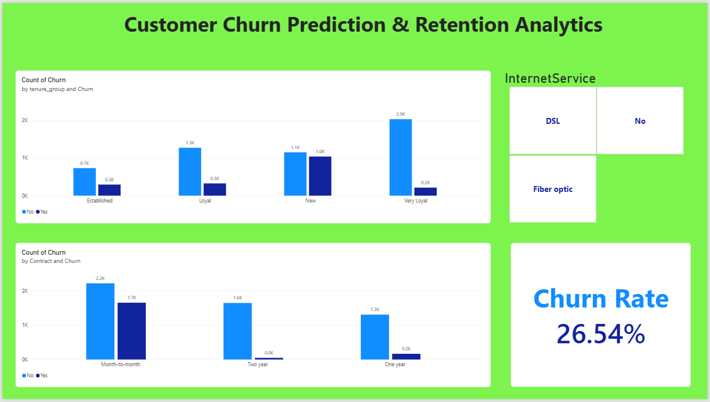

# Customer Churn Prediction & Retention Analytics

An end-to-end data science project predicting customer churn for a telecom company, using SQL for business analysis, Python for data cleaning/EDA/machine learning, and Power BI for an interactive dashboard.

## Business Problem
Customer churn (customers leaving) directly impacts revenue. This project identifies which customers are at risk of churning and why, so a business can take targeted retention action.

## Dataset
- **Source:** [IBM Telco Customer Churn Dataset](https://www.kaggle.com/datasets/blastchar/telco-customer-churn) (Kaggle)
- **Size:** 7,043 customers, 21 original features

## Tools Used
- **SQL (MySQL):** Business analysis queries, JOIN, subquery
- **Python (Pandas, NumPy, Matplotlib, Seaborn, Scikit-learn):** Data cleaning, EDA, feature engineering, machine learning
- **Power BI:** Interactive dashboard
- *Excel was intentionally not used — SQL and Python already covered all data manipulation and analysis needs.*

## Key Findings
- Overall churn rate: **26.54%**
- Month-to-month contract customers churn at **42.71%**, vs **11.27%** (one-year) and **2.83%** (two-year)
- New customers (0–12 months tenure) churn at **47.44%**, vs **9.51%** for long-term customers (49–72 months)
- **Fiber optic** internet and **Electronic check** payment are linked to higher churn
- Churned customers pay **higher average monthly charges** than retained customers

## Machine Learning Results
Three models were trained and evaluated with 5-fold cross-validation:

| Model | Cross-Val Mean F1 |
|---|---|
| Logistic Regression (tuned, C=100) | **0.595** |
| Random Forest | 0.528 |
| Decision Tree | 0.516 |

**Final model: Logistic Regression (C=100)**
- Accuracy: 79.63%
- Precision: 64.08%
- Recall: 52.94%
- F1 Score: 57.98%
- ROC-AUC: **0.84**

*Note: Recall of ~53% means the model still misses close to half of real churners at the default 50% cutoff — any real deployment should pair this model with human judgment, and the cutoff could be adjusted depending on business priorities.*

## Business Recommendations
1. Focus retention efforts on customers in their first 12 months (highest churn risk)
2. Investigate fiber optic service quality/reliability
3. Simplify and speed up the electronic check payment process
4. Offer incentives for month-to-month customers to switch to annual contracts

## Dashboard

## Project Structure
customer-churn-prediction/
├── data/ # Raw + Power BI-ready datasets
├── notebooks/ # Jupyter notebook (cleaning, EDA, ML)
├── sql/ # SQL business analysis queries
├── dashboard/ # Power BI .pbix file
├── images/ # Dashboard screenshot
├── requirements.txt
└── README.md

## How to Run This Project
1. Clone this repo
2. Create a virtual environment and install dependencies: `pip install -r requirements.txt`
3. Open `notebooks/01_data_cleaning_eda.ipynb` in Jupyter Notebook
4. Open `dashboard/churn_dashboard.pbix` in Power BI Desktop to view the interactive dashboard

## Author
Thirumalesh — [GitHub](https://github.com/S-Thirumalesh)
📧 Email: thirumalesh9360@gmail.com
🌐 LinkedIn: https://www.linkedin.com/in/s-thirumalesh/
